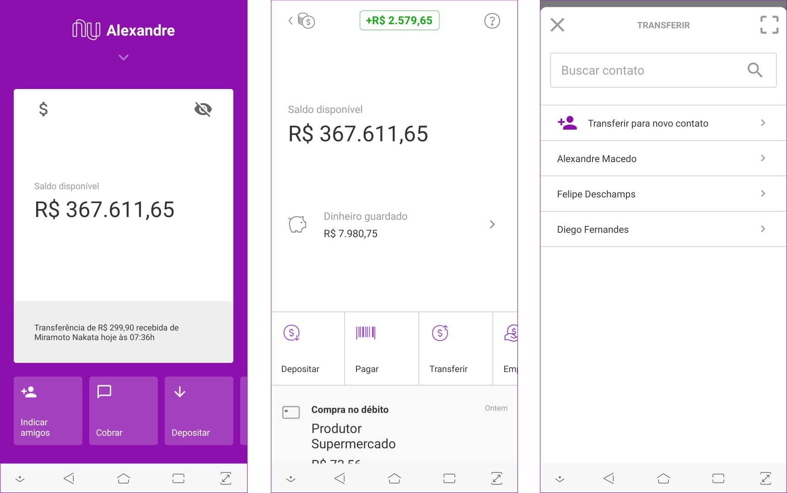

<h1 align="center">
  
</h1>

<h3 align="center">
  Nubank clone
</h3>

<h4 align="center">
  React Native
</h4>

<p align="center">
  

  <a href="https://github.com/AlexandreMacedoo">
    
  </a>

  

  <a href="https://github.com/AlexandreMacedoo/nubank-clone/stargazers">
    
  </a>
</p>

# nubank-clone
Nubank clone build with React Native

## Pré requisitos

- Git (https://git-scm.com/)
- Yarn (https://yarnpkg.com/lang/en/)
- React Native (https://docs.rocketseat.dev/ambiente-react-native/introducao)

## Instalação
### Clonando o repositório
Com o Git instalado em sua sua máquina, abra o terminal.
Windows -> **cmd** ou **powershell** execute os comandos abaixo:
```ssh
$ git clone https://github.com/AlexandreMacedoo/nubank-clone.git
$ cd nubank-clone
```
### Instalando as dependências
Com o projeto clonado em sua máquina, execute o comando abaixo:

```ssh
$ yarn
```
ou
```ssh
$ npm install
```

### Executando
Após instalar todas as dependências:

#### Android
Com seu dispositivo ou emulador configurado, execute o comando:
```ssh
$ yarn android
```
#### IOS
Com seu dispositivo ou emulador configurado, execute o comando:
```ssh
$ yarn ios
```

## Prévia
<p align="left">
  
</p>

## Consulte a documentação
- Documentação da API - EM BREVE

## License
The nubank-clone is open-sourced software licensed under the [MIT license](https://opensource.org/licenses/MIT).

